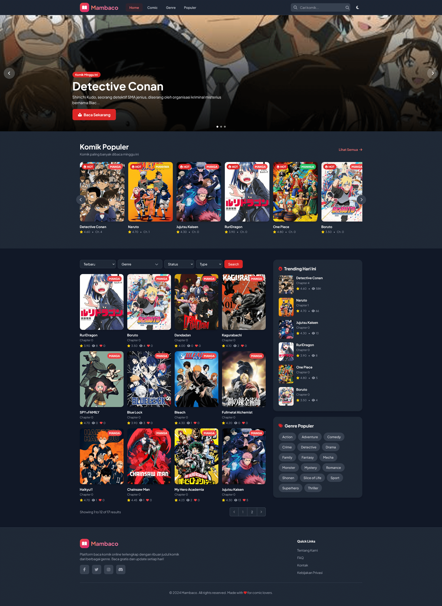
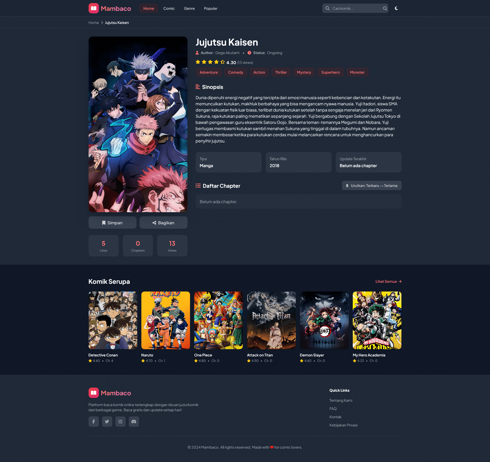
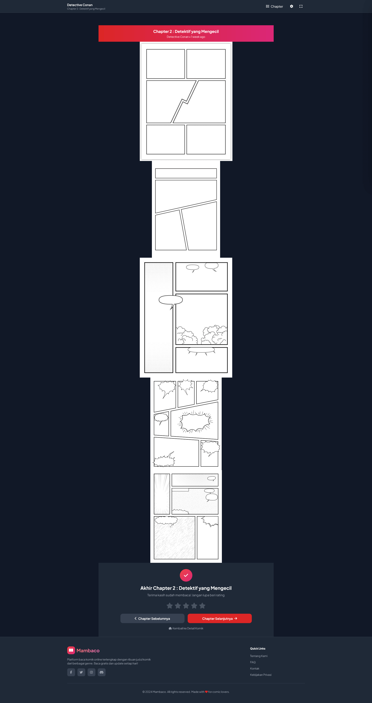
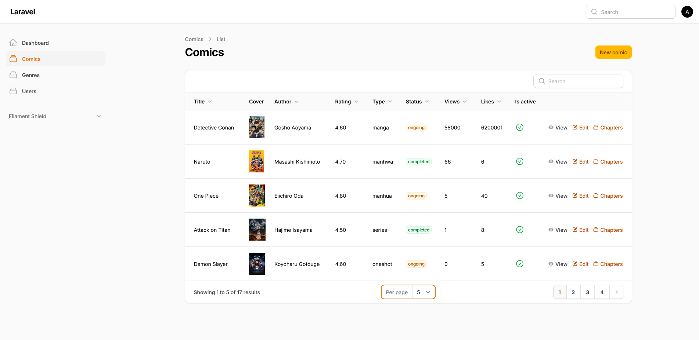

# 📚 Mambaco

**Mambaco** adalah website untuk membaca komik secara online yang dibangun menggunakan **Laravel**, **Livewire**, dan **Filament Admin Panel**.

Website ini memungkinkan pengguna untuk:

-   Menjelajahi komik terbaru atau populer.
-   Membaca komik per chapter dengan tampilan yang nyaman.
-   Admin dapat mengelola komik, chapter, genre, dan pengguna melalui dashboard **Filament**.

---

## 🔧 Teknologi

-   **Framework:** Laravel 12
-   **Realtime UI:** Livewire 3
-   **Admin Panel:** Filament 4
-   **Database:** MySQL
-   **Frontend:** Tailwind CSS

---

## 🚀 Fitur

### Untuk Pengguna:

-   Menjelajahi daftar komik
-   Membaca komik chapter per chapter
-   Pencarian komik berdasarkan judul atau kategori

### Untuk Admin:

-   CRUD komik, chapter, kategori
-   Upload gambar chapter komik
-   Kelola pengguna dan hak akses melalui Filament Admin Panel

---

## 🖼 Tampilan

Berikut beberapa screenshot dari aplikasi:

  
_Halaman daftar komik untuk pengguna_

  
_Halaman informasi komik_

  
_Halaman membaca komik per chapter_

  
_Dashboard Admin menggunakan Filament 4_
